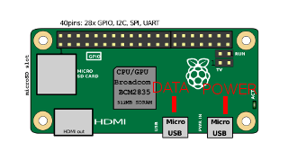

### First Steps

The first thing you'll want to do is connect to your Raspberry Pi Zero to set it up and do some configuration.  

#### Plugging it in
To begin, connect your Pi by plugging it into the micro USB marked DATA on the diagram below.  This USB plug will not only power but allow us to transfer data between your computer and the Pi.  The USB marked POWER is to power the device only.

After you have plugged in the device, you should see a flickering green light on the Pi.  The Pi Zero is doing its first run initialization at this point, so you should give it a few minutes before carrying on.  One thing to note however is that subsequent boots will not take as long.

#### Connecting to the Raspberry Pi
Connecting to the Raspberry Pi requires the use of a program called `ssh`.  `ssh` is a program that allows you to connect to remote and, and this case, very much local systems, and administrate them.  Usually you connect via IP address or domain/hostname.  In the case of our raspberry pis, we will be using hostname through the magic of service discovery.  Most modern computers run automatic service discovery usually called Bonjour or Avahi.  I won't go into too much details but it will essentially discover the Pi Zero and use its hostname to give the computer a local only designation for which we can connect to it by.  In this case, this will be `raspberrypi.local` which is essentially in format of `<pi hostname>.local`  It is important to know this as later you will be changing your Raspberry Pis hostname so subsequent connections will no longer be able to use the default of `raspberrypi.local`.

To connect, run `ssh pi@raspberrypi.local`.  This command will attempt to make an SSH connection to the Pi Zero as the user `pi`.  This user also has a default password of `raspberry` so you can enter that in when prompted.

Note:  You will be prompted to trust the IP/hostname when you make a connection for the first time.  This should be safe to do so if you're using the `.local` method of connecting.  If you are using an IP Address, you'll want to ensure the IP is correct.

#### Initial Config
On the Raspberry Pi, we're running an linux distribution called Rasbian, configured specifically to support the Pi.  It comes with a user friendly tool that we can use to change your password.  Run `sudo raspi-config` which will prompt you for the password for the `pi` user which is still `raspberry`.  A GUI will appear.  You can use the `arrow keys` to navigate through the menu options/settings, `enter` to accept a menu option and `escape` to return to the previous menu.

The first two things we're going to do is Expand the Filesystem and change the password for the `pi` user.  Rasbian when prepared on the SD Card does not use the entire SD cards size, leaving a bunch of unused space.  Let's solve that now by selecting the `Expand the Filesystem` option in the menu.  You screen will flicker with commands but eventually you'll be brought back to the GUI.

Next, select Change User Password and follow the on-screen instructions to set a new password for the `pi` user.  Please remember this password.

Note:  The GUI is actually just a front-end for commands being run in the background.  In the chase of changing your password, the GUI simply ran the command `passwd`.

#### Installing the Prerequisites
This Dev Day will require some prerequisite software.  When you first login you should be in your users home directory.  If you run `ls ~/` you will see a couple of script files ending in `.sh`  For now we will focus on `install.sh`.  This script pulls down and installs quite a lot of software that we'll need to either run our Micronaut projects or add some security on your Raspberry Pi.  This software includes:  `git`, `ufw`, `openjdk`, `python` and `wiringPi`.  In addition to software installation, it also pulls down an Adafruit project build specifically to show off the capabilities of the Bonnet screen connected to your Pi and enables and configures `ufw` or `Uncomplicated Firewall` only allowing connections to sshs default port of 22.

You'll need all of this to continue on with the `pi-naut` portion of the Dev Day so let's run it wit the following command: `sudo ./install.sh`.  This will take *awhile* so you can take this opportunity to move onto the [non-Pi Micronaut project](../README.md#exercises).  Make sure your leave this command running in a terminal.  Assuming this command completes successfully, you will see a cat on your screen.  Yay!

If for some reason you can't run the example script above, or you get any errors, curl up into a ball and wait until someone comes to your rescue.

Note:  From your home directory, you can also run `python Adafruit_Python_SSD1306/examples/buttons.py` after the install script runs. It will display some shapes on the screen that represent the bonnets built in Joystick and Buttons.  The screen should react to the button clicks and joystick movements you make.
